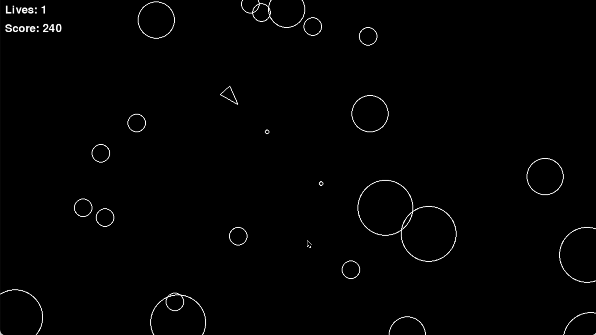

# Asteroids Game

Asteroids is a classic arcade-style game where the player controls a spaceship, avoiding and destroying asteroids. The objective of the game is to survive as long as possible and score points by shooting and splitting asteroids.

## Features

- Move and rotate your spaceship
- Shoot asteroids to destroy them
- Asteroids split into smaller pieces when hit
- The game ends when you lose all lives

## Install

To install the game, first clone the repository and navigate into the project folder:

```
git clone https://github.com/Solu7ion/asteroids.git
cd asteroids
```

Next, create and activate a virtual environment:

### Windows

```
python -m venv venv
venv/Scripts/activate
```

### macOS and Linux

```
python -m venv venv
source venv/bin/activate

```

Install the necessary dependencies:

```
pip install -r requirements.txt
```

## Run the Game

Once all dependencies are installed, you can start the game by running:

```
python3 main.py
```

## Usage

- Move: Press W to move forward and S to move backward.
- Rotate: Use A to rotate left and D to rotate right.
- Shoot: Press SPACE to shoot at the asteroids.
- Objective: Destroy all asteroids while avoiding collisions.

## Screenshots


